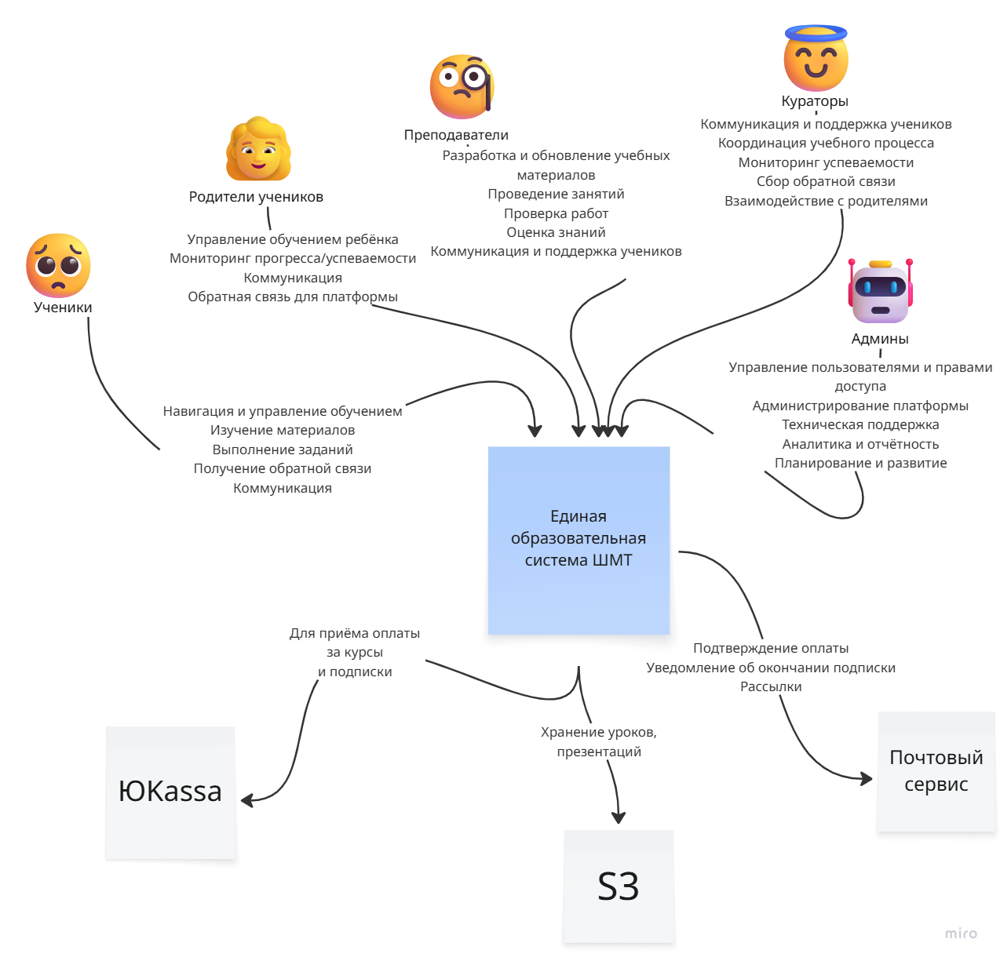
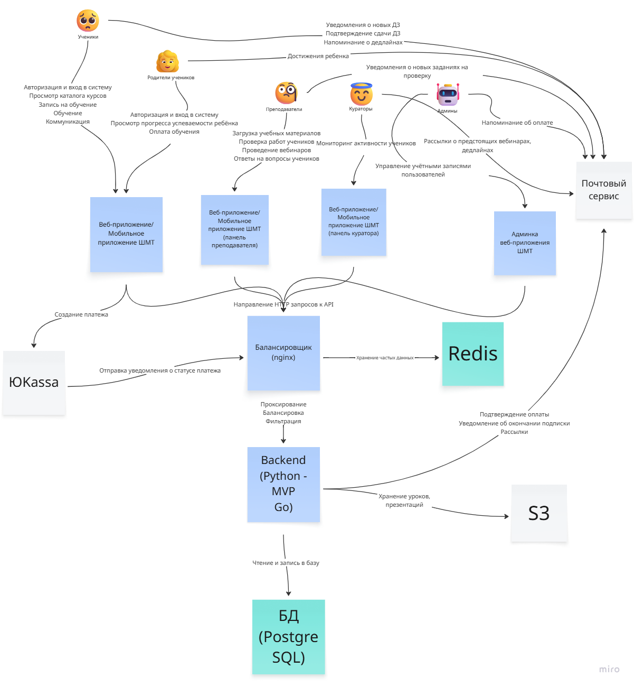

# ДЗ №4 — Схема C4, стек
______

## C4
___

### Level 1

_____

### Level 2

______

## Выбор ключевых технологий для MVP

### 1. Веб- и мобильное приложение (интерфейс)

**Цель:** обеспечить удобный доступ пользователям (ученикам, родителям, преподавателям).  
**Технологии:** веб-приложение и мобильное приложение ШМТ.  
**Обоснование:**  
+ веб-приложение покрывает большинство пользователей без необходимости установки ПО;
+ мобильное приложение расширяет доступность (обучение «на ходу»);
+ универсальность: поддержка разных устройств и ОС.  

### 2. Балансировщик нагрузки (Nginx)

**Цель:** распределить нагрузку между серверами, обеспечить стабильность работы.  
**Обоснование:**
+ Nginx — стандарт для балансировки нагрузки и проксирования запросов;
+ высокая производительность, низкая задержка;
+ поддержка HTTPS, кэширования, сжатия данных;
+ критически важен при росте числа одновременных пользователей.

### 3. Backend (Python, MVP, Go)

**Цель:** обработка бизнес-логики, взаимодействие с БД, API для фронтенда.  
**Обоснование:**  
+ Python: удобен для быстрой разработки MVP, богатая экосистема библиотек (Django и т.д.);
+ MVP: подход к разработке, позволяющий сосредоточиться на ключевых функциях;
+ Go (Golang): эффективен для высоконагруженных частей системы (например, обработка платежей, фоновые задачи) — высокая производительность, низкая память.

### 4. База данных (PostgreSQL)

**Цель:** хранение структурированных данных (профили пользователей, курсы, оценки, история платежей).  
**Обоснование:**  
+ PostgreSQL — надёжная СУБД с поддержкой сложных запросов и транзакций;
+ открытый исходный код, стабильность, масштабируемость;
+ поддержка JSON для гибкого хранения метаданных;
+ интеграция с Python (psycopg2), Go (pq) и другими языками.

### 5. Redis

**Цель:** кэширование данных, хранение сессий, очереди задач (например, рассылки).  
**Обоснование:**  
+ Redis — in-memory хранилище, ускоряющее чтение часто используемых данных (например, статусы заданий, кэш аутентификации);
+ поддержка структур данных (хеши, списки, наборы);
+ механизмы публикации/подписки для реал-тайм уведомлений;
+ низкая задержка, простота интеграции с бэкендом.  

### 6. S3 (Amazon S3)

**Цель:** хранение медиафайлов (видеоуроки, PDF, изображения).  
**Обоснование:**  
+ S3 — надёжное облачное хранилище с высокой доступностью и масштабируемостью;
+ оптимизация доставки контента через CDN;
+ разделение хранения медиа и структурированных данных — экономия ресурсов БД;
+ интеграция с веб- и мобильными приложениями через подписанные URL.  

### 7. ЮKassa

**Цель:** обработка платежей, интеграция с банковскими картами.  
**Обоснование:**  
+ ЮKassa — проверенный платёжный агрегатор с поддержкой российских банков;
+ готовая инфраструктура для безопасных транзакций (PCI DSS);
+ API для лёгкой интеграции с бэкендом (Python/Go);
+ поддержка рекуррентных платежей (подписки).

### 8. Почтовый сервис

**Цель:** рассылка уведомлений (дедлайны, сдача ДЗ, достижения).  
**Обоснование:**  
+ использование специализированного почтового сервиса (например, SendGrid, Mailgun) гарантирует доставку и соблюдение антиспам-правил;
+ API для автоматизации рассылок из бэкенда;
+ аналитика открытий/кликов для оценки эффективности коммуникаций.
___

Данный стек технологий обеспечивает баланс между скоростью разработки (MVP), надёжностью (PostgreSQL, S3) и производительностью (Nginx, Redis, Go). Он покрывает все ключевые сценарии (обучение, платежи, уведомления) и легко масштабируется при росте аудитории.